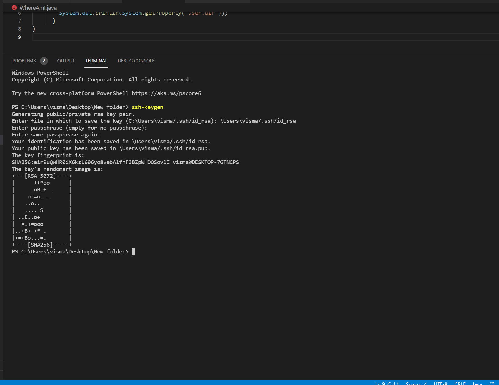

## Lab Report 1

*This site will teach you how to log into a Course Specific Account*

**Step 1**
>This frist thing you will want to do is go to VSCode, and download it.
VSCode is an IDE where you will be able to run and 
test code.

**Step 2** 
>Once you have downloaded VSCode, you will also need to download a program called OpenSSH. Once that is downloaded, you should look up your course specific account with this [Link](https://sdacs.ucsd.edu/~icc/index.php).

After this, go to VSCode and link your account to the remote computer. You will need to start a new terminal and make a command (**ssh your course specific account**)

**Step 3**
>The next step we are going to do is run some commands. Here are some commands to try!
* cd (takes you to home directory)
* ls (Lists content in your directory)

**Step 4**
>Next we are going to move our files with scp. Grab any file you want, I used (WhereAmI.java) and enter the same command for your ssh excpet change the ssh with scp. After you enter your credentials, you should be able to run files on the remote computer.

**Step 5**
>Now we are going to set up a key so we don't need to use our password all the time. If you go to terminal and type ssh-keygen you will be able to make a phrase that will save a public and private file which the ssh will use instead of your password

**Step 6**
Our last step is to just make running remotely easier. Some tips and tools you can use are:
- ^ - Runs most recent command
- tab - auto completes code
- ctrl s - saves file
- history - lists all of the commands typed recently

 ## *I Hope this helped*
## *Vismay*