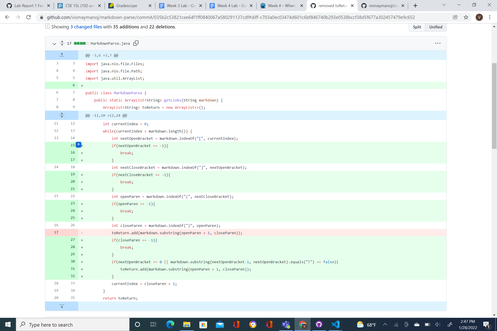

## Lab Report 2

My group had three bugs that we were tasked to fix. 

The first one was that I did not have a throw Excpetion IO, so my tetser was not able to access the file it had to in order to run.

For this error, there was no link to a specific test, as all of our test files (1-4) had this error. 
[Link](https://github.com/vismaymanoj/markdown-parse/commit/39047f525cd02294b8f4364bb66a362596a82369#diff-c4d343f38cf62ed2fa12aa0d52021ed9da6fca82b64a80fec22a750f40e114b1)

When we ran this code, this was the error message we got.

The second error my group had was that we had an error in producing the link. It would duplicate the link which was not what we wanted. 

For this error, we had a toReturn statement that would return a the link so we removed it.
[Link](https://github.com/vismaymanoj/markdown-parse/commit/035b2c53821cee64f1ff0840067a580291137cdf#diff-c703a0ec03474d601c6bf846740b293e0538bccf38d5f677a302457479e9c652)

This was the error message produced

Our 3rd problem was that we would get an infinite loop which would be stuck on characther 32. It would not recongize the open parenthesis, so we had to had some loops to fix it.
 

For this error, we had to add some if statements that would see when the array ended and what it index was expected, or had to find.
[Link](https://github.com/vismaymanoj/markdown-parse/commit/80b51e6d4e68e77011b3c3296bf6e58bf61fe967#)

This was the error message.
