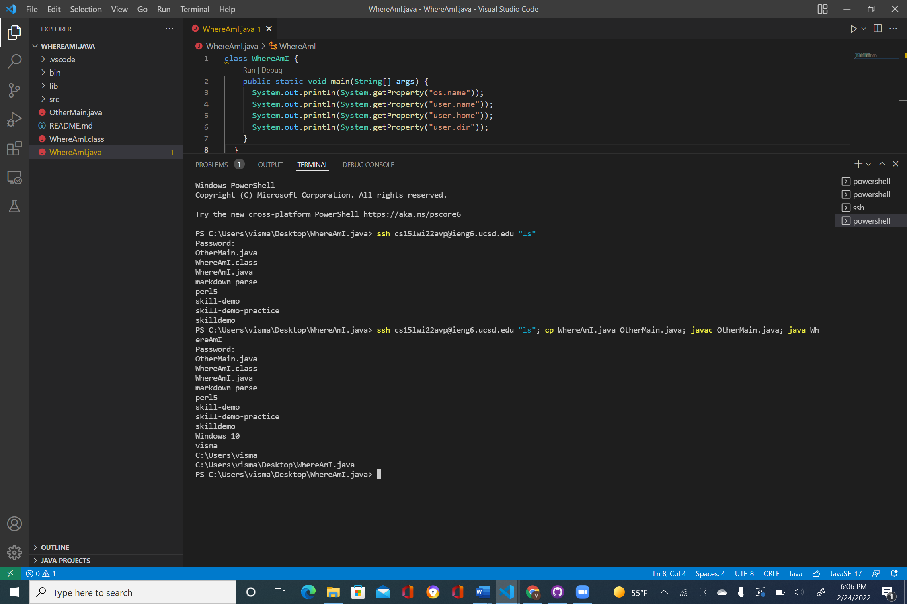

## Lab Report 3 
**Copying directories with ```scp -r```**

I originally copied my whole directory onto my account, but there were alot of uneccesary files regarding what I wanted to do.


The next thing I did was copy just my whole markdown-parse directory onto my ieng 6 account.
I copied just my mark down parse directory by running this command:
```
>  scp -r *.java *.md lib/ cs15lwi22@ieng6.ucsd.edu:markdown-parse
```
```scp``` copies the code, while ```r``` tells scp to work recursively.


The next step I did was log into my ieng6 account and then comile and run the tests we made from Markdown Parse. 
.

Lastly, I used what I learned in the previous lab, and was able to run multiple commands at once by using a semicolon. I not only copied my directory, but I ran the test file as well. 


*This is the end of Lab 3*
