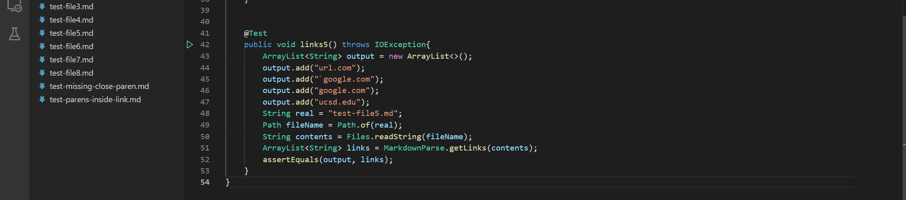
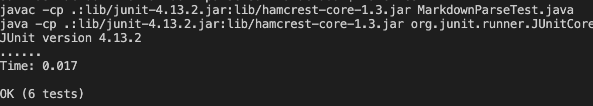
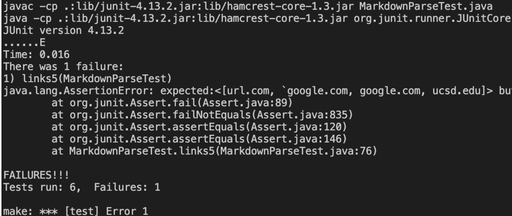
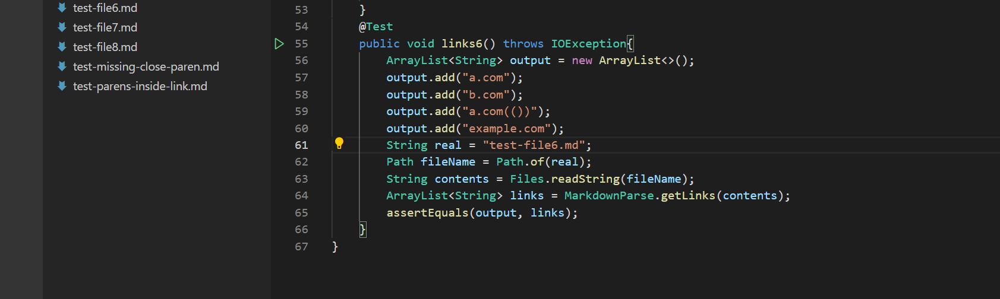
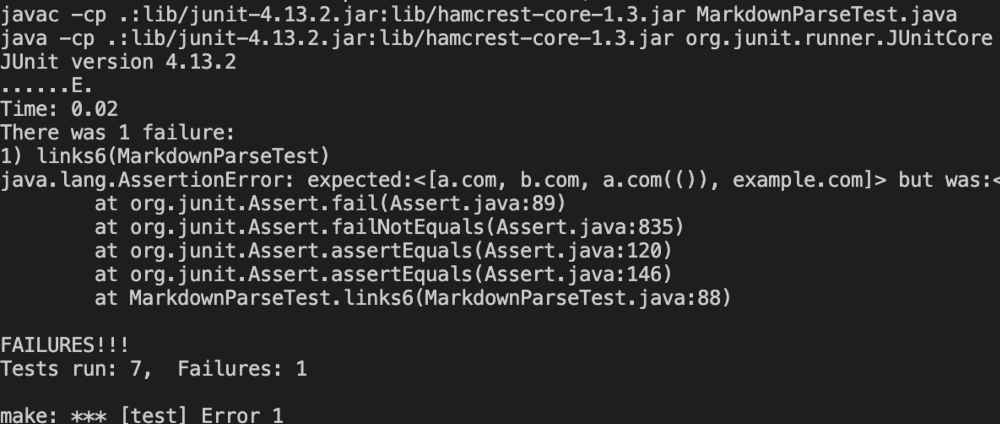
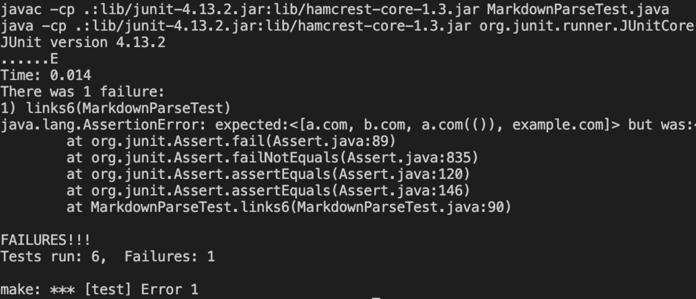
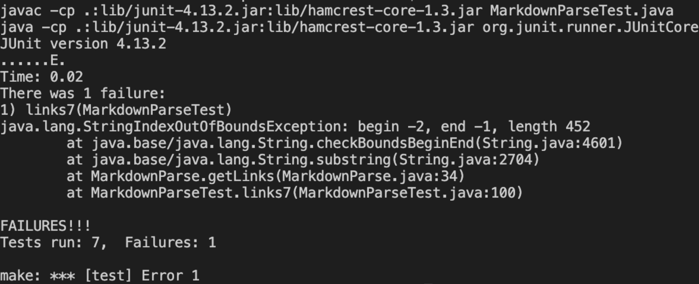
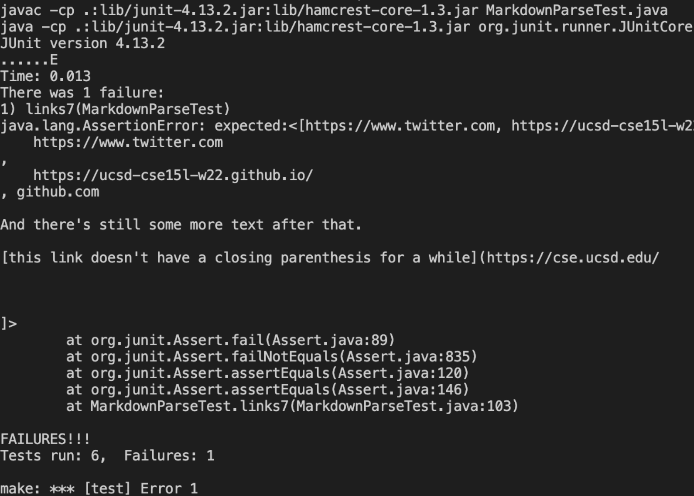

# Lab Report 4
**Hello and Welcome to Lab 4**

Here is a link to our code: [Link](https://github.com/vismaymanoj/markdown-parse)

Here is the code we reviwed: [Link](https://github.com/zhl010/markdown-parse)

**Snippet 1**

```[a link`](url.com)```

```[another link](`google.com)```

```[`cod[e`](google.com)```

```[`code]`](ucsd.edu)```

**What we expect**

[a link](url.com)

another link`

cod[e

code]

This was my test:


This was the result:

It passed.

This was the other groups results.

It did not pass.

**Snippet 2**

```[a [nested link](a.com)](b.com)```

```[a nested parenthesized url](a.com(()))```

```[some escaped \[ brackets \]](example.com)```

**What we expect**

[a nested link](b.com)

a nested parenthesized url

some escaped [ brackets ]

This was my test:


This was the result:

This time it did not pass

This was the other groups results.

It did not pass either.

**Snippet 3**

```[this title text is really long and takes up more than ```
```one line```

```and has some line breaks](```
   ``` https://www.twitter.com```
```)```

```[this title text is really long and takes up more than ```
```one line](```

```https://ucsd-cse15l-w22.github.io/```
```)```


```[this link doesn't have a closing ``` ```parenthesis](github.com```

```And there's still some more text after that.```

```[this link doesn't have a closing parenthesis for a while](https://cse.ucsd.edu/```


```)```

```And then there's more text```

**What we expect**

[this title text is really long and takes up more than one line

and has some line breaks]( https://www.twitter.com )

this title text is really long and takes up more than one line

[this link doesn't have a closing parenthesis](github.com

And there's still some more text after that.

[this link doesn't have a closing parenthesis for a while](https://cse.ucsd.edu/

)

And then there's more text

This was my test:


This was the result:

This did not pass again.

This was the other groups results.

It did not pass either.

## Summary

1) Our first snippet worked pretty good, so I don't think there is a need to change anything. The brackets and backticks were printed, and we got the expected output. 

2) This was where we had our first issue. I think because it was nested, it had some difficulties. If we can make the counter look for brackets and parenthesis, it could fix this. It should look for pairs as well, so it can differ from regular ones, and ones that are part of the code.

3) This one was probably the most challenging, and I don't believe there is a short solution. I think it could possibly similar to snippet 2 so it looks for pairs so it can differntiate sperate lines from what is actually part of the code, and it will print the links we want.