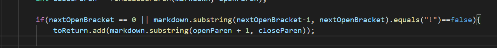

# Lab Report 5
**Hello and Welcome to Lab 5**
This is the last lab of the quarter!

We were given 652 files to run and print onto one file. 

We had to implemet Professor Politz's Markdown file, and then we did it with our implementaion too. 

We used ```diff``` to compare the different files. 

The command we used to compare the two files was 

```diff results.txt ../markdown-parsePolitz/results.txt```

## Test case 1
test-files/342.md was the first one we got different results from. 

Professor Politz's result: ```[/foo`]```

My result: ```IndexOutOfBoundsException```

Both of these were wrong.


The reason for this mistake was our backticks. We should have included a back tick checker. 

Specific code: 

An if statement to account for back ticks should fix this problem. 

## Test Case 2

test-files/530.md was another file that was different.

Professor Politz's result:```[]```

My result: ```[moon.jpg]```

Professor Politz's was correct.

The ```!``` was most likely our problem. I don't believe we accounted for it. 

Specific code: Specific code: 

Another if statement could potenitally fix this problem. 

## Conclusion
```diff``` helps us compare results for differnet files anmd makes running and comparingg tests much faster. 